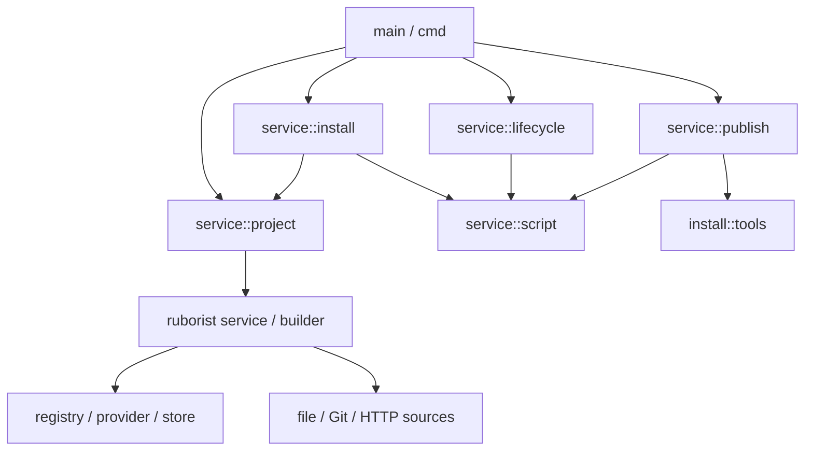

# Package manager responsibilities

The published Rust units remain `utoo-pm` and `utoo-ruborist`. Native source
support is feature gated inside ruborist; the browser crate does not depend on
PM. Existing public ruborist import paths and graph fields remain available.
PM and WASM consume the curated ruborist re-exports.

## Operation inputs

`cmd` adapts CLI flags, project selection and output. `service::project` owns
discovery, manifest editing, lock validation and persistence. Its
`resolve_and_save_lock` entry point serves both `deps` and dependency changes.
Workspace graph construction returns the graph directly.

Installation takes `InstallOptions`: root, omitted dependency kinds, script
policy, reify mode and output mode. `ScriptEnvironment` supplies the initial
directory, PATH, installation scope, prefix and extra npm environment.
Reusable services do not parse command arguments, change the process working
directory or exit the process. `--from` migration runs before registry/config
initialization in the CLI.

## Installation and scripts

Resolution events only prefetch package caches. The final lock determines
platform selection, omitted dependencies, workspace links and target paths.
The scheduler bounds download, extraction and cloning independently and keeps
these stages overlapping. Packages whose hooks or binary rewriting modify
content receive private copies.

`script` constructs an npm environment, executes one process, captures both
output pipes concurrently and waits for completion. `lifecycle`, install hooks,
pack and publish select packages, order stages and apply optional policies.
Script stages wait for every admitted script before reporting failure.

At the existing native-hook trigger, `install::tools` prepares node-gyp. It
materializes the complete production tree before bootstrap hooks, supplies
provisional tool/bin paths to those hooks and advertises readiness only after
all hooks and global links succeed. Preparation is deduplicated by effective
prefix/config. Cycles fail explicitly; failure or cancellation permits retry.

Publication owns packing, manifest rewriting, provenance and upload. A
postpublish failure after a successful upload remains
`PublishOutcome::Committed`, so callers report what reached the registry.

## Ownership and shutdown

The demand driver owns graph/index mutation. Source workers and manifest jobs
return values and preserve underlying error causes. Native work keeps Arc and
Rayon parallelism; WASM uses the existing local execution path.

Dropping an install owner stops admission and wakes pending requesters. Its
actor drains already-started stages. A worker panic follows the same drain
path. CPU/blocking work retains its resources until its closure actually ends.
Extraction holds the cache lock inside that closure. Tool leases survive
scheduler and child-process cleanup, and clean incomplete tools before a retry
can acquire the same root.

Cancelled script owners request termination and asynchronously reap the child
before releasing resources. This owns the spawned child; it does not introduce
a new process-group policy. Manifest writer destruction closes its channel;
normal CLI shutdown explicitly awaits workers and joins completed writers off
the async executor. Cleanup diagnostics do not replace the business error.

Self-pin prepares asynchronously. The CLI drains work before Unix `exec`;
Windows releases the release-slot lock after spawning and before asynchronously
waiting for the child. An unfinished background self-update check is cancelled
on command completion. Once its installer has spawned, the CLI waits for it;
update failures retain their notice/cooldown and do not change command results.

## Cache compatibility

Verified content lives in `<cache>.utoo-v2/packages`; manifests live in the
v2 namespace partitioned by registry. Source/digest identity participates in
content caching and scheduling. Existing v1 entries remain on disk and count as
misses, so the first installation after migration downloads packages again.
`utoo clean` handles both generations. CLI/JSON, package-lock and node_modules
formats are unchanged.

## Checks

Run `cargo test -p utoo-pm --test module_boundaries` to check parsed Rust imports
and calls across these boundaries, including aliases and grouped imports.
Run `cargo test -p utoo-ruborist --doc` to compile every Rust documentation
example, and `cargo test -p utoo-ruborist --test public_paths` to check legacy
and facade type compatibility. Native/default/no-default feature checks and
the real WASM/browser workflow cover the target-specific paths.

Local tests do not replace macOS/Linux/Windows CI, isolated PM e2e or repeated
cold/warm cache benchmarks. Acceptance evidence for a change must identify the
actual tested commits and retain any unfinished checks.
